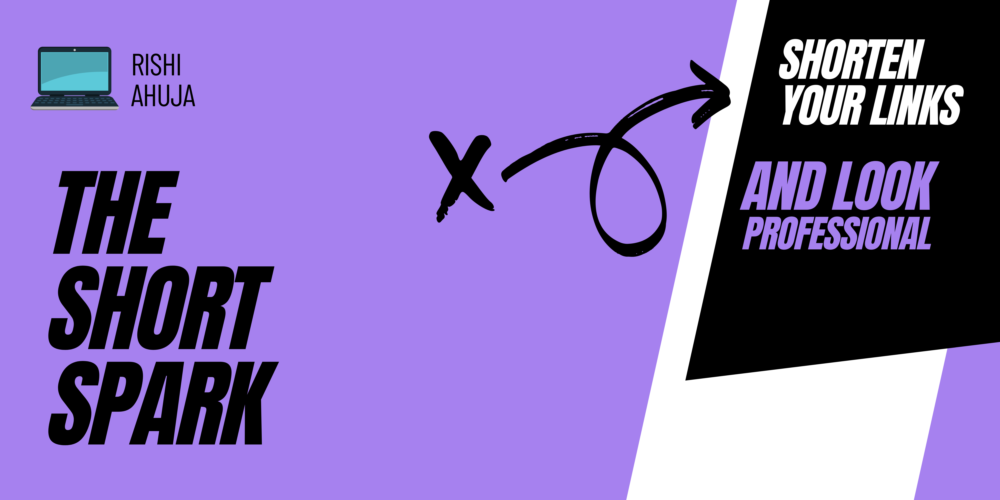
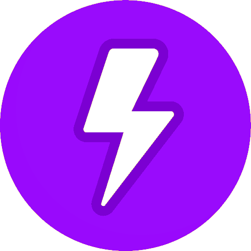
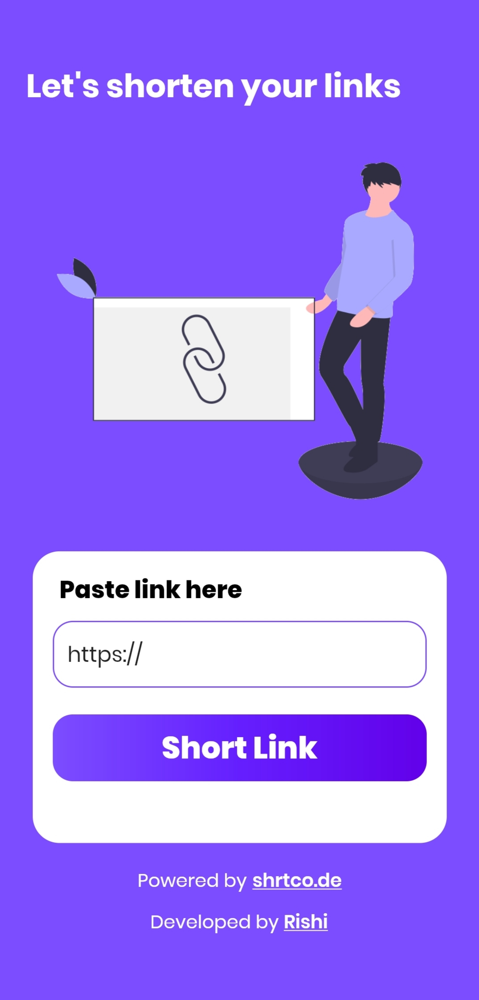
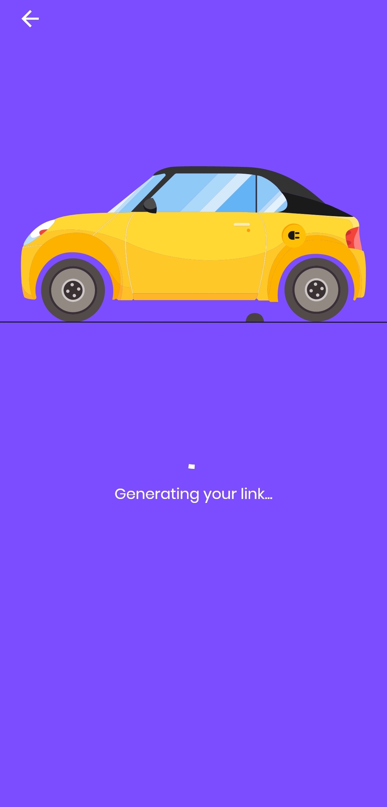
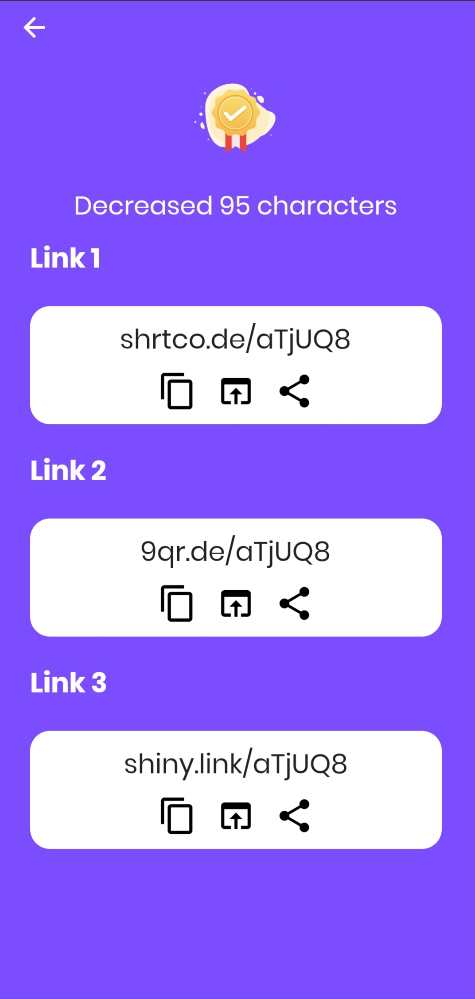

 

  
  

  <h3 align="center">Short Spark</h3>

  
  

    An awesome link shortener for all your long links
     
    <a href="https://github.com/RishiAhuja/short-spark"><strong>Explore the docs »</strong></a>
     
     
    <a href="https://shortspark.web.app">Use now</a>
    ·
    <a href="mailto:www.rishiahuja@gmail.com">Report Bug</a>
    ·
    <a href="mailto:www.rishiahuja@gmail.com">Request Feature</a>
  

<!-- ABOUT THE PROJECT -->
## About The Project

 
Short spark is a link shortner by which you can short all your long links and have a immersive experience with lottie animations.

Of course, nothing is perfect, short spark also comes with its caviets. It uses <a href="https://shrtco.de/docs">shrtco.de</a> API which makes it a little bit slow.

### Built With

* [Flutter](https://flutter.dev)
* [Firebase](https://firebase.google.com)
* [Shrtco.de](https://shrtco.de/docs)

<!-- GETTING STARTED -->
## Getting Started

To get started you have to go to <a href='https://shortspark.web.app'>Short Spark</a> and enter your link to decrease its size.

<!-- CONTACT -->
## Contact

Rishi Ahuja - [Github Portfolio](https://rishiahuja.github.io/my-portfolio)  
[Email](mailto:www.rishiahuja@gmail.com)  
Short Spark: [Project link](https://github.com/RishiAhuja/short-spark) 

## Acknowledgements
* [Shrtco.de](https://shrtco.de)
* [Undraw](https://undraw.co)
* [Lottie Files](https://lottiefiles.com/)
* [Firebase Hosting](https://firebase.google.com)
* [Flat Icons](https://flaticon.com)
* [GitHub](https://github.com)

## Follow Me
<a href='https://instagram.com/_rishi__ahuja'> 
  </img>
</a>
<a href='https://www.youtube.com/channel/UCZF3uzRaNdRBSsBrHpQJXkA'> 
  </img>
</a>
<a href='https://www.facebook.com/rishi.ahuja.75470/'> 
  </img>
</a>

## Support me
<a href='https://buymeacoffee.com/RishiAhuja'> 
  </img>
</a>
<a href='https://patreon.com/RishiAhuja'> 
  </img>
</a>
